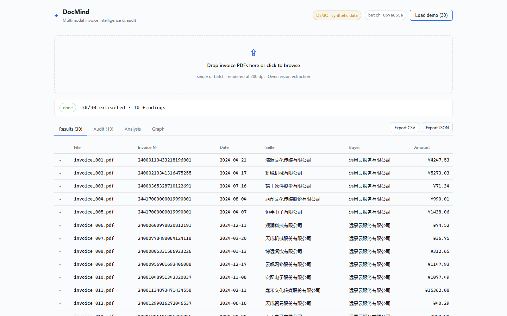
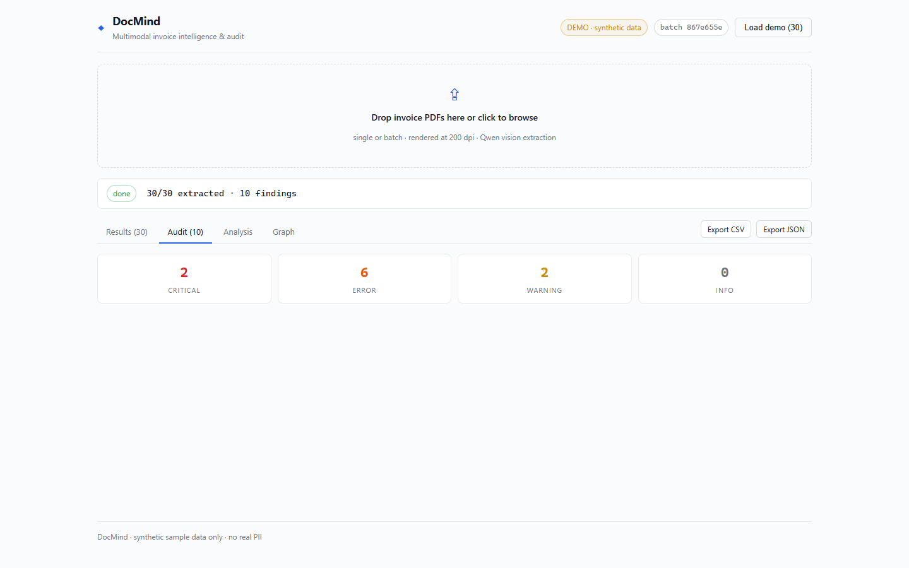
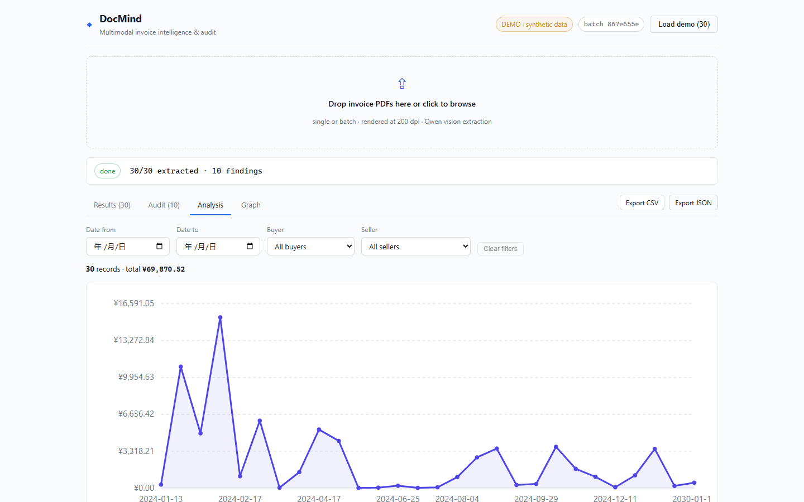
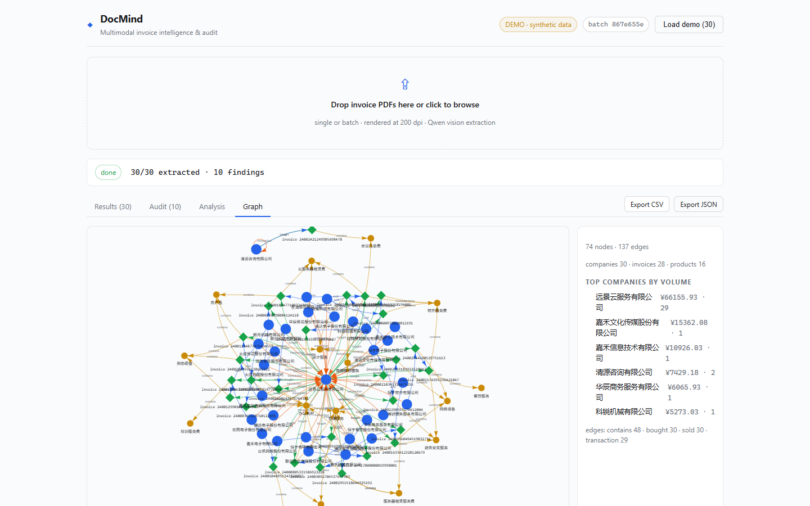

# DocMind — Multimodal Invoice Intelligence & Audit Platform

> **智能发票抽取与自动审计平台** · FastAPI · Qwen-VL (DashScope) · Rule-based Audit Engine · Knowledge Graphs · React dashboard

DocMind is a production-grade, open-source re-implementation of a university
coursework project ("发票智能抽取系统"). It turns raw invoice PDFs into
structured, confidence-annotated data, then **automatically audits a whole
batch** for fraud and error patterns — duplicate invoice numbers, inconsistent
amount arithmetic, implausible tax rates and broken party information — and
finally visualizes the batch as a knowledge graph of companies, invoices and
products.

Built for the real-world financial workflow of *"scan → extract → verify →
archive"*, DocMind is what a student-grade OCR demo becomes when you add
typed schemas, an extensible audit engine, a reproducible benchmark and a
polished UI.


-4f8cff)


## Screenshots

| Extraction results | Audit findings | Analysis (trend chart) | Knowledge graph |
|---|---|---|---|
|  |  |  |  |

---

## Motivation

| Before (coursework) | After (DocMind) |
|---|---|
| Hard-coded API key in `config.py` | All secrets via environment / `.env` (pydantic-settings) |
| Gemini call returning loosely-typed JSON | Typed Pydantic schema + **per-field confidence** |
| Save rows to Excel, that's it | **Audit engine** (8 extensible rules) over each batch |
| Custom graph with `hash()` node ids | Deterministic **networkx** knowledge graph + JSON API |
| `templates/index.html` (jinja-ish page) | **React + TypeScript + Vite** dashboard with progress, audit, **analysis** & graph views |
| Real (PII-bearing) sample invoices | Fully **synthetic** sample set + objective benchmark |
| Manual "does it work?" | `pytest` suite (120+ tests), field-level accuracy benchmark |

## Architecture

```mermaid
flowchart LR
    subgraph Frontend [React + TypeScript + Vite]
        UI[Upload / progress / results]
        AU[Audit panel]
        AN[Analysis view — trend chart + filters]
        GV[Graph view (vis-network)]
    end
    subgraph Backend [FastAPI]
        API[API routes]
        BS[Batch store]
        EX[Extraction service]
        AE[Audit engine]
        KG[Graph builder]
    end
    subgraph External
        DS[DashScope Qwen-VL<br/>OpenAI-compatible endpoint]
    end
    UI -->|upload PDFs| API
    API --> BS
    BS --> EX -->|image + prompt| DS
    DS -->|structured JSON + confidence| EX
    EX --> AE
    AE --> KG
    BS --> AU
    BS --> GV
```

Pipeline per batch: **extract** (PDF → PNG @200dpi → Qwen vision model →
normalize to `InvoiceDocument`, decode the QR code, repair tax-id checksums)
→ **audit** (every registered rule over the whole batch, findings sorted by
severity) → **graph** (companies / invoices / products with aggregated
transaction edges).

## Feature highlights

1. **Multimodal extraction with confidence** — each field carries a model
   confidence in `[0, 1]`; a dedicated audit rule flags low-confidence fields
   so reviewers know what to double-check.
2. **QR code cross-check** — the invoice QR code (which encodes number, total
   and date) is decoded with OpenCV and compared against the vision
   extraction; mismatches fire an audit finding (tampering / OCR-error
   detector). Deterministic **tax-id repair** fixes wrong GB 32100-2015 check
   characters after extraction (recorded in `doc.corrections`).
3. **Extensible audit engine** — one class per rule, auto-registered via
   subclassing; `/api/rules` lists them, the engine runs them all:

   | rule_id | what it checks | severity |
   |---|---|---|
   | `dup_invoice_number` | same invoice number twice in one batch (duplicate reimbursement) | CRITICAL |
   | `arithmetic_total` | `amount_incl ≈ amount_excl + tax` | ERROR |
   | `line_items_sum` | sum of line amounts/taxes vs. declared totals | WARNING |
   | `tax_rate` | rate ∉ {0,1,3,5,6,9,13} or implied rate ≠ declared rate | ERROR |
   | `party_info` | missing/invalid/checksum-failing tax ids, missing names, buyer == seller | ERROR/WARNING |
   | `invoice_date` | missing or future issue date | WARNING |
   | `low_confidence` | any field below the confidence threshold | WARNING |
   | `qr_crosscheck` | QR-encoded number/total/date vs. extracted fields | ERROR/WARNING |

4. **Knowledge graph** — networkx-based, deterministic node ids, aggregated
   seller→buyer "transaction" edges; JSON API + interactive vis-network view.
5. **Analysis view** — a dependency-free SVG trend chart of invoice amounts
   grouped by issue date (auto-switches to monthly buckets when there are
   more than 30 distinct dates), with date-range and buyer/seller filters and
   a detail table — parity with the coursework original's "数据分析" tab.
6. **Benchmark** — 30 synthetic invoices with a machine-readable ground truth
   (`benchmark/ground_truth.json`); `scripts/run_benchmark.py` reports
   field-level accuracy + mean confidence (see [docs/benchmark.md](docs/benchmark.md)).
7. **Privacy-safe samples** — original coursework invoices contained real PII
   and a leaked API key; the repository ships only **synthetic** invoices
   (see [docs/data-compliance.md](docs/data-compliance.md)) and a secret
   scanner ([scripts/scan_secrets.py](scripts/scan_secrets.py)).
8. **Honest demo data** — the UI labels every batch as `REAL UPLOAD` or
   `DEMO · synthetic data`; failed files can be retried individually or as a
   group (`POST /api/batches/{id}/retry`).

## Quick start

Prerequisites: Python 3.11+, Node 18+.

```bash
# 1. clone & install backend
git clone <your-repo-url> docmind && cd docmind
python -m venv .venv
.venv/Scripts/activate            # Windows (Linux/macOS: source .venv/bin/activate)
pip install -e ".[dev]"

# 2. configure secrets (never commit .env)
cp .env.example .env
#   edit .env → set DASHSCOPE_API_KEY (Alibaba Cloud Bailian)

# 3. generate the synthetic sample set + ground truth (optional, already shipped)
python scripts/generate_synthetic_invoices.py --count 30

# 4. run the backend (serves API + built frontend at http://127.0.0.1:8000)
uvicorn app.main:app --reload

# 5. (dev) run the frontend with hot reload
cd frontend && npm install && npm run dev   # http://localhost:5173
```

Then open http://127.0.0.1:8000, click **Load demo (30)** (offline, mock
extractor) or upload your own PDFs (real Qwen extraction).

> No API key? Everything except real vision extraction works offline: the
> demo mode and all tests use the deterministic `MockExtractor` backed by the
> ground truth. `python scripts/smoke_test_api.py` verifies the real endpoint.

## API

| Method | Path | Description |
|---|---|---|
| `GET` | `/api/health` | liveness |
| `GET` | `/api/rules` | registered audit rules + metadata |
| `POST` | `/api/invoices/upload` | multipart PDF upload → `{batch_id}` (async) |
| `GET` | `/api/batches/{id}` | batch status, per-file results, findings, graph |
| `GET` | `/api/batches/{id}/audit` | audit findings + severity summary |
| `GET` | `/api/batches/{id}/graph` | knowledge graph + insights |
| `GET` | `/api/batches/{id}/export?format=csv\|json` | export batch |
| `POST` | `/api/batches/{id}/retry` | re-extract failed files, then re-audit |
| `POST` | `/api/demo/load` | offline demo batch (mock extractor) |

Interactive docs at `/api/docs`.

## Benchmark

```bash
# offline sanity (mock extractor, no API cost)
python scripts/run_benchmark.py --extractor mock

# real extraction (requires DASHSCOPE_API_KEY)
python scripts/run_benchmark.py --extractor dashscope --limit 30
```

Latest real-API results are summarized in [docs/benchmark.md](docs/benchmark.md).
The ground truth is regenerated deterministically by the synthetic generator,
so benchmark runs are reproducible.

## Tests

```bash
pytest            # 120+ tests, fully offline (LLM calls are mocked)
```

Coverage: schema contract, every audit rule, graph construction, JSON
normalization (incl. tolerant parsing of flaky LLM JSON), evaluation metrics,
and API integration (TestClient + mock extractor). `scripts/smoke_test_api.py`
is the optional real-API smoke test.

## Project layout

```
app/                  FastAPI application (layered)
  core/               pydantic-settings config (env-driven, no hard-coded keys)
  models/             Pydantic schemas: InvoiceDocument (+confidence), AuditFinding
  services/
    extraction/       pdf→png, JSON repair, DashScope extractor, mock extractor
    audit/            rule registry + 8 built-in rules + engine
    graph/            networkx knowledge-graph builder
    eval/             field-level accuracy metrics
    batch/            thread-safe batch store (JSON persistence)
  api/                REST routes
frontend/             React + TS + Vite dashboard (upload/progress/results/audit/graph/export)
scripts/              synthetic data generator, benchmark, smoke test, secret scan, server check
samples/              30 synthetic invoice PDFs (reportlab, Chinese e-invoice layout)
benchmark/            ground_truth.json + benchmark results
tests/                120+ pytest tests (offline)
docs/                 benchmark report, data-compliance, NOTICE (credits)
```

## Roadmap / known limitations

- **Model choice**: `qwen-vl-plus` is the default vision model; `qwen3.5-ocr`
  is kept as fallback but produced poor *structured* JSON in our tests
  (great OCR layout output, weak field extraction) — see
  [docs/benchmark.md](docs/benchmark.md) for numbers.
- Vision models occasionally return malformed JSON or internally-consistent
  hallucinated totals; the extractor retries and repairs, the audit engine
  cross-checks (incl. the QR code), but *no automated system can fully
  replace a human reviewer*.
- QR decoding is done on the 200 dpi page render; very low-resolution scans
  may fail to decode (the `qr_crosscheck` rule then silently skips).
- Batch state is persisted as JSON files (single-node); a SQLite/Postgres
  backend would scale to larger deployments.
- No auth/RBAC yet — intended for internal/trusted use.
- Confidence values from `qwen-vl-plus` are coarse (often 1.0); calibration
  against extraction errors is future work.

## Disclaimer

DocMind is a demonstration/research project. It is **not** a certified tax or
financial audit system, and its findings must be verified against official
sources. All sample data is synthetic. See [docs/data-compliance.md](docs/data-compliance.md)
and [docs/NOTICE.md](docs/NOTICE.md).

## License

MIT — see [LICENSE](LICENSE). Third-party components and credits are listed
in [docs/NOTICE.md](docs/NOTICE.md).

---

## 中文摘要

**DocMind** 是一个面向财务报销与审计风控场景的多模态票据智能审核平台，
由课程作业《发票智能抽取系统》大幅升级而来：原作业将 Gemini API Key
硬编码在 `config.py` 中、只做单张抽取并存 Excel；本项目重构为
FastAPI 分层架构，密钥全部走环境变量（pydantic-settings），使用阿里云
百炼 Qwen-VL 视觉模型做结构化抽取（每个字段附带置信度），并新增：

- **审计引擎**：批量自动稽查发票号码重复、价税合计算术不一致、税率
  异常（0/1/3/5/6/9/13%）、购销方信息缺失/税号校验位错误/自开发票等，
  规则采用注册机制可自由扩展，每条告警含规则名、证据与严重级别；
- **二维码交叉校验**：用 OpenCV 解码发票二维码（含号码/金额/日期），与
  视觉抽取结果比对，不一致即告警（防篡改/OCR 误差检测）；税号 GB 32100
  校验位错误自动修复并记录；
- **知识图谱**：基于 networkx 构建公司-发票-商品关系图并提供 JSON API，
  前端用 vis-network 交互可视化；
- **React + TypeScript + Vite 看板（浅色主题）**：单张/批量上传、处理进度、
  字段+置信度表格、按级别着色的告警面板、图谱视图、CSV/JSON 导出、失败
  文件单独重试；界面明确区分"真实上传"与"合成演示数据"；
- **评测基准**：30 张 reportlab 生成的合成中文发票 + 机器可读 ground
  truth，评测脚本输出字段级准确率与平均置信度（见 `docs/benchmark.md`）；
- **数据合规**：原始样例含真实个人信息与企业税号，一律不入库；仓库仅
  包含合成样例与标注，附密钥扫描脚本（`scripts/scan_secrets.py`）。

后端 `uvicorn app.main:app` 一键启动（自动托管前端构建产物），离线演示
与全部 120+ 测试均使用 mock 抽取器，不消耗 API 额度。
